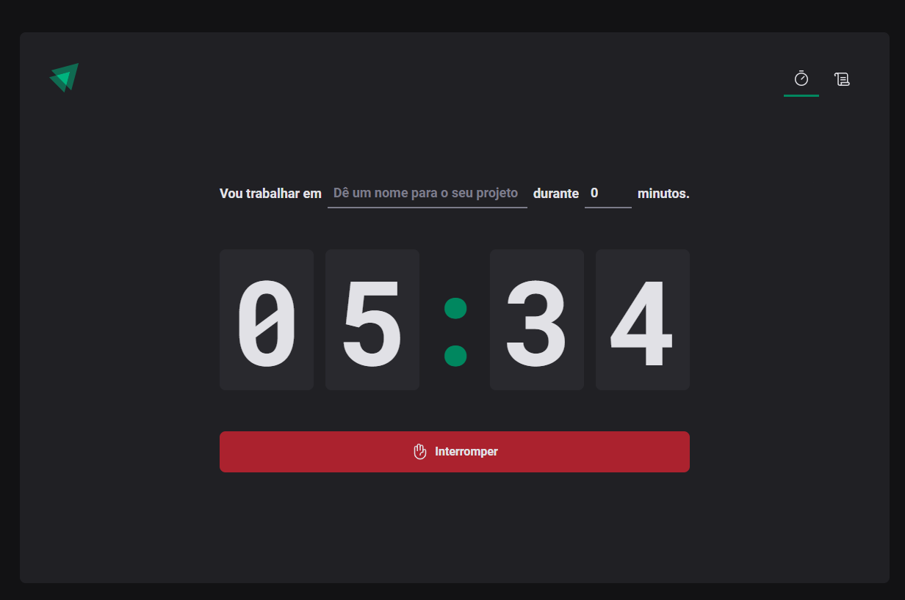
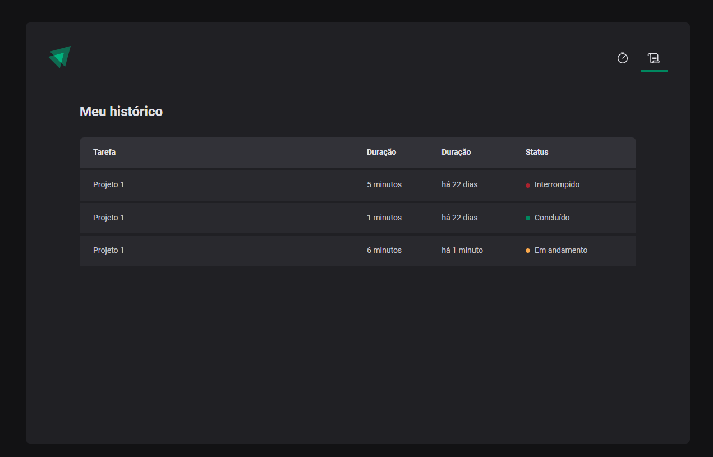

# ⏱️ **Ignite Timer** 🚀

**Uma aplicação moderna para controle de tempo em projetos, aumentando sua produtividade e eficiência.**

Este projeto foi desenvolvido como parte de um estudo prático no curso de **React.js** da [Rocketseat](https://rocketseat.com.br/). A aplicação utiliza tecnologias modernas para oferecer uma experiência rápida, intuitiva e funcional para gerenciamento de tempo em atividades e projetos.

---

## ✨ **Funcionalidades**

- 🎯 **Criação de Tarefas:** Adicione atividades específicas para monitoramento do tempo.
- ⏳ **Timer Personalizado:** Inicie, pause e reinicie o temporizador conforme necessário.
- 📊 **Histórico de Tarefas:** Consulte atividades concluídas, pendentes e canceladas.
- ✅ **Validações Dinâmicas:** Garantia de dados consistentes com **Zod**.
- 📱 **Responsividade:** Interface otimizada para dispositivos móveis, tablets e desktops.
- ⚡ **Experiência Rápida:** Carregamento otimizado com **Vite**.

---

## 🔧 **Tecnologias Utilizadas**

As principais tecnologias utilizadas no projeto incluem:

- **⚛️ React.js:** Biblioteca JavaScript para construção de interfaces dinâmicas.
- **⚡ Vite:** Ferramenta de build ultrarrápida para desenvolvimento moderno.
- **📑 React Hook Form:** Gerenciamento de formulários de forma eficiente.
- **🛡️ Zod:** Validação de dados com segurança e tipagem.
- **🗺️ React Router:** Navegação dinâmica entre páginas.
- **💅 Styled Components:** Estilização dinâmica com CSS-in-JS.
- **🛠️ TypeScript:** Tipagem estática para maior robustez e manutenção do código.

---

## 🖥️ **Pré-requisitos**

Antes de começar, certifique-se de ter as seguintes ferramentas instaladas:

- [Node.js](https://nodejs.org/) (v16 ou superior)
- [Git](https://git-scm.com/)

---

## 🚀 **Como Executar o Projeto**

Siga as instruções abaixo para rodar o projeto localmente:

1. **Clone este repositório:**

   ```bash
   git clone https://github.com/gafredo/02-ignite-timer.git
   cd 02-ignite-timer
   ```

2. **Instale as dependências:**

   ```bash
   pnpm install
   ```

3. **Inicie o servidor de desenvolvimento:**

   ```bash
   pnpm run dev
   ```

4. **Acesse no navegador:**
   ```
   http://localhost:3001
   ```

---

## 🌟 **Demonstração**




---

## 📜 **Licença**

Este projeto está sob a licença **MIT**.

---

## 📚 **Recursos de Estudo**

- 📖 Curso Rocketseat: [Rocketseat](https://rocketseat.com.br/)
- 📖 Documentação React: [React.js](https://reactjs.org/)
- 📖 Documentação Vite: [Vite](https://vitejs.dev/)
- 📖 Documentação Zod: [Zod](https://zod.dev/)
- 📖 Documentação React Hook Form: [React Hook Form](https://react-hook-form.com/)
- 📖 Documentação Styled Components: [Styled Components](https://styled-components.com/)

---

## 🙌 **Agradecimentos**

Agradecimentos especiais à **Rocketseat** pelo conteúdo educacional de alta qualidade. 🚀

---

## 🌐 **Conecte-se Comigo**

📧 **Email:** [gafredo@gmail.com](mailto:gafredo@gmail.com)
💼 **LinkedIn:** [Gabriel Fredo](https://linkedin.com/in/gabriel-fredo-38211650)
